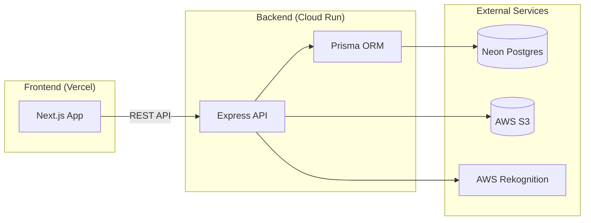
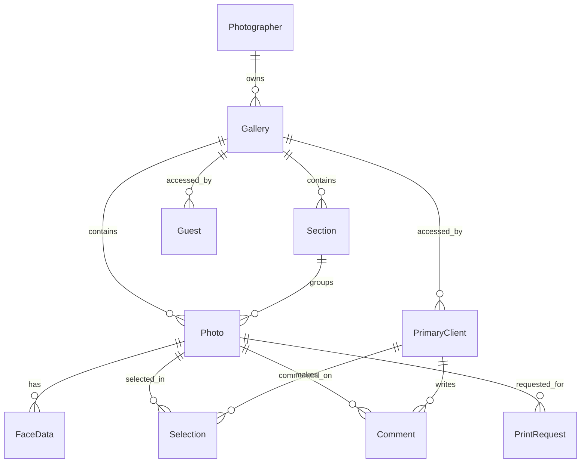

# Pickal System Overview

> **Live URLs:**
> - Frontend: https://pickal-tan.vercel.app
> - Backend: https://pickal-482912-rtm2stdhpq-el.a.run.app

---

## 1. System Architecture



---
 
## 9. Privacy & Safety Guarantees
 
| Guarantee | Implementation | Verified |
|-----------|----------------|----------|
| **Guest Access Isolation** | Database-level filtering (`IN matchedIds`) prevents guests from viewing unmatched photos. | ✅ |
| **Credential Secrecy** | `privateKey` and `customPassword` are hidden from guest API responses. | ✅ |
| **Download Permissions** | Server-side checks ensure guests can only ZIP/download their own matched photos. | ✅ |
| **No Indexing** | `robots.txt` and meta tags prevent search engine indexing of gallery pages. | ✅ |
 
---
 
## 1a. Core Flows
 
### Access Control
- **Photographer**: JWT Auth via Email/Password. Full control.
- **Primary Client**: 
  - **Private Key**: UUID-based full access.
  - **Custom Slug + Password**: User-friendly full access.
- **Guest**: 
  - **Selfie Verification**: Mobile + Selfie -> Rekognition -> Session Token.
  - **Strict Scope**: Can only see/download photos containing their face.
 
### Pagination & Infinite Scroll
- **Strategy**: Cursor-based pagination (`before/after` ID) for performance.
- **Page Size**: 50 photos per batch.
- **State Management**: Frontend caches loaded photos per-section to allow instant tab switching.
- **Consistency**: Sorting by `[sortOrder, createdAt, id]` ensuring stable cursors.
 
### Download All
- **Method**: Streaming ZIP generation (Server-side).
- **Flow**: Client req -> Server (Auth verify) -> S3 Stream -> Archiver (ZIP) -> Client Response Pipe.
- **Benefit**: Low memory footprint (no buffering entire ZIP), supports large galleries.
 
---
 
## 2. Limits & Guardrails

### Application Limits

| Limit | Value | Location | Log Indicator | How to Update |
|-------|-------|----------|---------------|---------------|
| **Max photos per upload** | 50 | [photo.routes.ts:50](file:///Users/saurav.sahu/Documents/randomprojects/pickal/backend/src/routes/photo.routes.ts#L50) | `[UPLOAD_LIMIT] File count limit exceeded` | Change `MAX_PHOTOS_PER_UPLOAD` constant |
| **Max photo size** | 20 MB | [photo.routes.ts:51](file:///Users/saurav.sahu/Documents/randomprojects/pickal/backend/src/routes/photo.routes.ts#L51) | `[UPLOAD_LIMIT] File size limit exceeded` | Change `MAX_PHOTO_SIZE_MB` constant |
| **Selfie attempts per hour** | 5 | [rate-limit.service.ts:12](file:///Users/saurav.sahu/Documents/randomprojects/pickal/backend/src/services/rate-limit.service.ts#L12) | `[RATE_LIMIT] Selfie attempt blocked` | Change `MAX_ATTEMPTS` constant |
| **Selfie rate limit window** | 1 hour | [rate-limit.service.ts:13](file:///Users/saurav.sahu/Documents/randomprojects/pickal/backend/src/services/rate-limit.service.ts#L13) | Same as above | Change `WINDOW_SECONDS` constant |
| **Web image max dimension** | 1920px | [image.service.ts:19-20](file:///Users/saurav.sahu/Documents/randomprojects/pickal/backend/src/services/image.service.ts#L19) | N/A | Change `WEB_MAX_WIDTH/HEIGHT` |
| **Inline sections in header** | 4 | [GalleryHeader.tsx](file:///Users/saurav.sahu/Documents/randomprojects/pickal/frontend/src/components/GalleryHeader.tsx) | N/A | Change `MAX_INLINE_SECTIONS` |
| **Pagination Page Size** | 50 | [page.tsx](file:///Users/saurav.sahu/Documents/randomprojects/pickal/frontend/src/app/g/%5Bid%5D/page.tsx) / [API](file:///Users/saurav.sahu/Documents/randomprojects/pickal/backend/src/routes/photo.routes.ts) | N/A | Update `limit` param in `loadSectionItems` |

### Infrastructure Limits (Cloud Run)

| Limit | Value | Location | Log Indicator | How to Update |
|-------|-------|----------|---------------|---------------|
| **Min instances** | 0 | Cloud Run config | Console → Metrics (Active Instances) | `gcloud run services update pickal-482912 --min-instances=N` |
| **Max instances** | 3 | Cloud Run config | Console → Metrics (Active Instances) | `gcloud run services update pickal-482912 --max-instances=N` |
| **Request concurrency** | 80 | Cloud Run config | Console → Metrics (Request Latencies) | `gcloud run services update pickal-482912 --concurrency=N` |
| **Memory** | 512 MB | Cloud Run config | `Memory limit exceeded` in logs | `gcloud run services update pickal-482912 --memory=1Gi` |
| **CPU** | 1 vCPU | Cloud Run config | N/A | `gcloud run services update pickal-482912 --cpu=2` |
| **Request timeout** | 60s | Cloud Run config | `Timeout exceeded` | `gcloud run services update pickal-482912 --timeout=120s` |

---

## 3. Where to Find Logs

| Service | Log Location | Command |
|---------|--------------|---------|
| **Cloud Run Backend** | Google Cloud Console | `gcloud run logs read pickal-482912 --region=asia-south1` |
| **Cloud Run Metrics** | [Console](https://console.cloud.google.com/run/detail/asia-south1/pickal-482912/metrics) | N/A |
| **Vercel Frontend** | Vercel Dashboard → Logs | N/A |
| **Neon Database** | Neon Console → Monitoring | N/A |

### Key Log Patterns to Watch

```
[RATE_LIMIT]          → Selfie rate limits hit
[UPLOAD_LIMIT]        → Upload limits hit
Error:                → Application errors
Memory limit          → Need to increase Cloud Run memory
Timeout exceeded      → Need to increase Cloud Run timeout
```

---

## 4. Database Schema

### Tables Overview

| Table | Purpose | Key Columns |
|-------|---------|-------------|
| `photographers` | Photographer accounts | `id`, `email`, `passwordHash`, `name`, `businessName`, `logoUrl` |
| `galleries` | Photo galleries/events | `id`, `name`, `eventDate`, `privateKey`, `photographerId`, `selfieMatchingEnabled`, `downloadsEnabled` |
| `sections` | Gallery sub-sections | `id`, `name`, `sortOrder`, `galleryId` |
| `photos` | Individual photos | `id`, `filename`, `originalKey`, `webKey`, `lqipBase64`, `galleryId`, `sectionId` |
| `face_data` | Face recognition data | `id`, `externalFaceId`, `provider`, `boundingBox`, `confidence`, `photoId` |
| `primary_clients` | Full-access gallery viewers | `id`, `sessionToken`, `name`, `email`, `galleryId` |
| `guests` | Selfie-based gallery viewers | `id`, `sessionToken`, `mobileNumber`, `selfieKey`, `matchedPhotoIds`, `galleryId` |
| `guest_selfie_faces` | Cached selfie-face mappings | `id`, `galleryId`, `faceId`, `faceHash`, `matchedPhotoIds` |
| `selfie_rate_limits` | Rate limit tracking | `id`, `galleryId`, `guestSessionId`, `attemptCount`, `windowStart` |
| `selections` | Primary client photo selections | `id`, `photoId`, `primaryClientId`, `addedBySessionId` |
| `comments` | Photo comments | `id`, `content`, `photoId`, `primaryClientId` |
| `print_requests` | Print order requests | `id`, `status`, `quantity`, `size`, `photoId`, `primaryClientId`, `guestId` |

### Entity Relationships



---

## 5. Environment Variables

### Backend (Cloud Run)

| Variable | Purpose | Required |
|----------|---------|----------|
| `DATABASE_URL` | Neon PostgreSQL connection | ✅ |
| `JWT_SECRET` | Auth token signing | ✅ |
| `JWT_EXPIRES_IN` | Token expiry (e.g., `7d`) | ✅ |
| `FRONTEND_URL` | CORS origin | ✅ |
| `USE_MOCK_SERVICES` | `false` for production | ✅ |
| `AWS_ACCESS_KEY_ID` | S3/Rekognition access | ✅ |
| `AWS_SECRET_ACCESS_KEY` | S3/Rekognition secret | ✅ |
| `AWS_REGION` | AWS region | ✅ |
| `S3_BUCKET` | S3 bucket name | ✅ |
| `REKOGNITION_COLLECTION_ID` | Face collection ID | ✅ |

### Frontend (Vercel)

| Variable | Purpose | Required |
|----------|---------|----------|
| `NEXT_PUBLIC_API_URL` | Backend API URL | ✅ |

---

## 6. Cost Summary

| Service | Pricing Model | Current Config | Estimated Cost |
|---------|---------------|----------------|----------------|
| **Cloud Run** | Pay-per-use | 0-3 instances, 512MB | $0–5/month (idle = $0) |
| **Neon** | Free tier | 0.5 GB storage | $0 (free tier) |
| **AWS S3** | Storage + requests | Standard tier | $0.023/GB/month |
| **AWS Rekognition** | Per image | Face detection/search | $0.001/image |
| **Vercel** | Free tier | Hobby plan | $0 |

---

## 7. Known Gaps & Future Improvements

| Gap | Impact | Priority | Notes |
|-----|--------|----------|-------|
| No Secret Manager for env vars | Medium | High | Currently using plain env vars |
| No CDN for images | Medium | Medium | S3 direct access, could add CloudFront |
| No image caching headers | Low | Low | Browser caching not optimized |
| No monitoring/alerting | Medium | High | Add Cloud Monitoring dashboards |
| Single region deployment | Low | Low | asia-south1 only |
| No automated backups | Medium | Medium | Neon handles DB, S3 photos need backup policy |
| No CI/CD pipeline | Low | Medium | Manual deploy via `gcloud builds submit` |
| Rekognition costs could spike | High | High | No hard cap on face API calls |
| No request validation logging | Low | Low | Add structured logging for debugging |

---

## 8. Quick Commands Reference

```bash
# View live logs
gcloud run logs read pickal-482912 --region=asia-south1 --tail=50

# Check service status
gcloud run services describe pickal-482912 --region=asia-south1

# Update environment variable
gcloud run services update pickal-482912 --region=asia-south1 \
  --set-env-vars="KEY=value"

# Scale limits
gcloud run services update pickal-482912 --region=asia-south1 \
  --max-instances=5

# Deploy new version
cd backend
gcloud builds submit --tag asia-south1-docker.pkg.dev/pickal-482912/pickal-docker/backend:v2
gcloud run deploy pickal-482912 \
  --image=asia-south1-docker.pkg.dev/pickal-482912/pickal-docker/backend:v2 \
  --region=asia-south1

# Database access
npx prisma studio
```
